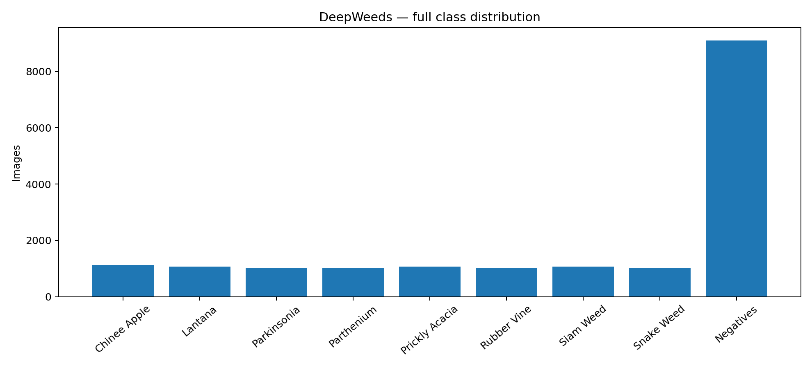
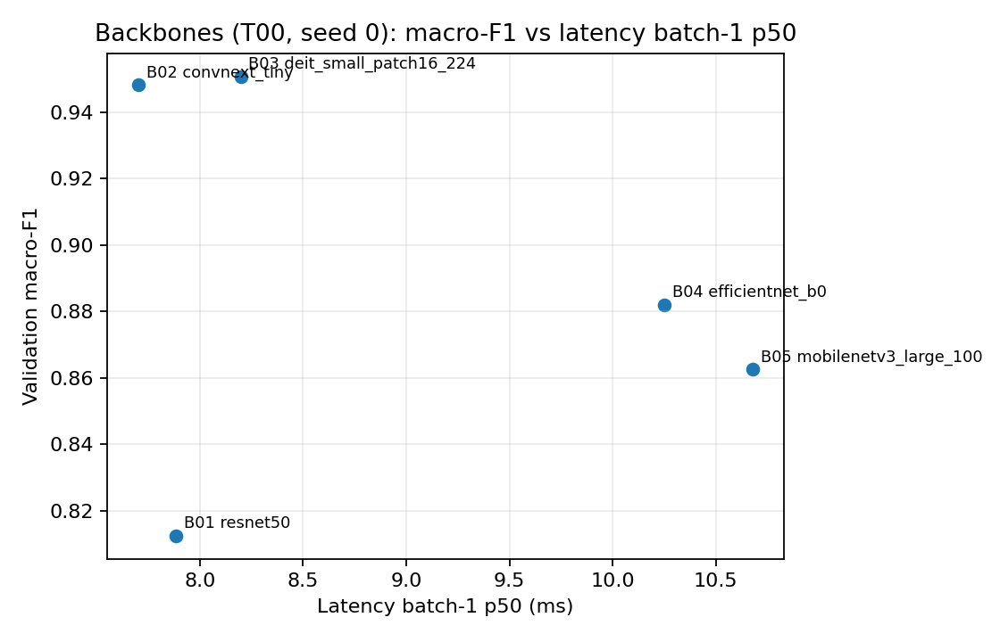
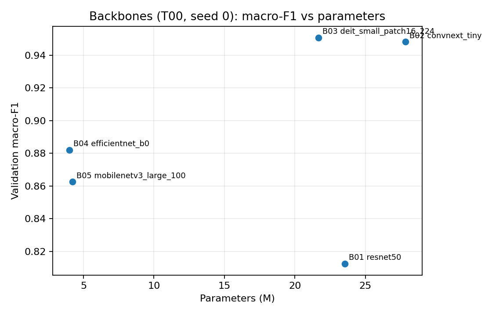
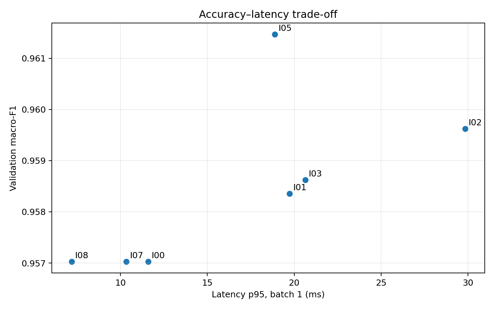
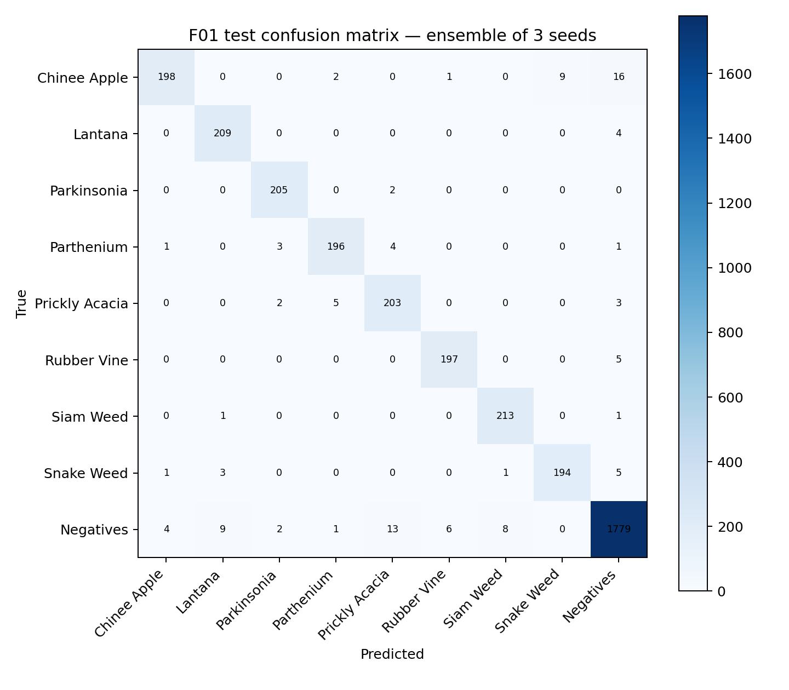
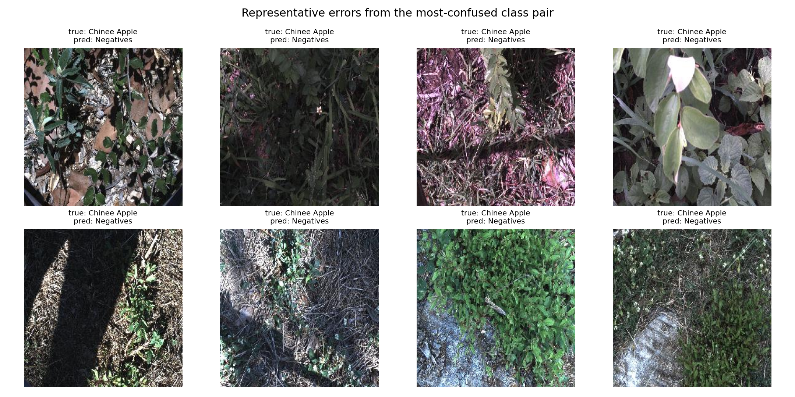

# Báo cáo Lab Day 2 — DeepWeeds: backbone, công thức huấn luyện và suy luận

Mọi con số dưới đây được sinh tự động từ `results.xlsx` (tên sheet ghi trong ngoặc), các file log trong `logs/` và `predictions/`; chỉ số test được tính lại bằng `eval.py`. Kết quả sàng lọc ở Bước 1–3 là **1 seed**.

## 1. Tóm tắt

- Bài toán: phân loại 9 lớp DeepWeeds (fold 0), chỉ số chính macro-F1.
- Đã chạy 5 backbone (Bước 1), 11 biến thể công thức + T00 ×3 seed (Bước 2), 7 cấu hình suy luận (Bước 3), chung kết F01 và mốc T00 + I00 mỗi cấu hình 3 seed (Bước 4).
- Cấu hình tốt nhất: **deit_small_patch16_224.fb_in1k + T06 {"mix": "cutmix", "mix_alpha": 1.0} + I07 temperature scaling (T khớp trên val)** (sheet Final).
- Test (3 seed): macro-F1 **0.9518 ± 0.0017**, top-1 **0.9623 ± 0.0012**; mốc T00 + I00: macro-F1 0.9474 ± 0.0015.
- Cải thiện macro-F1 test so với mốc: Δ = +0.0043, s = 0.0017 → **vượt nhiễu (Δ > s)** (sheet Summary).
- Độ trễ cấu hình chung kết: p95 = 10.34 ms ở batch 1 trên Tesla T4 (sheet Latency).

## 2. Dữ liệu và thiết lập

- DeepWeeds, 17.509 ảnh RGB 256×256, 9 lớp; fold 0 chính chủ (`train/val/test_subset0.csv`), không sửa CSV. Số ảnh: train 10501, val 3501, test 3507; ba giao rỗng, hợp đủ 17.509 (xem `step0_report.md`).
- Mất cân bằng: `Negative` ≈ 52%, tỉ lệ lớn nhất/nhỏ nhất ≈ 9,0 → dùng macro-F1 để chọn mô hình.

- Chỉ số: macro-F1 (chính), top-1, balanced accuracy, F1/recall theo lớp, ECE 15 bin — đúng định nghĩa `eval.py`.
- Val dùng cho mọi lựa chọn (backbone, công thức, suy luận, checkpoint, nhiệt độ T); test mở **một lần mỗi seed** ở Bước 4, cấu hình đã khóa trước trong `logs/final_lock.json`.

Công thức nền T00 (từ `logs/T00/seed0/config.json`):

| tham số | giá trị |
|---|---|
| epochs | 12 |
| batch_size | 64 |
| grad_accum_steps | 1 |
| lr_backbone | 0.0001 |
| lr_head | 0.001 |
| weight_decay | 0.05 |
| warmup_epochs | 1.0 |
| img_size | 224 |
| aug | basic |
| loss | ce |
| amp | True |

AdamW, weight decay không áp dụng cho norm/bias, head mới LR ×10, warmup 1 epoch rồi cosine, chọn checkpoint theo macro-F1 val (hòa lấy epoch sớm hơn). Train: RandomResizedCrop(224, scale 0,7–1) + lật ngang; val/test: resize 256 → CenterCrop 224; chuẩn hoá ImageNet.

Phần cứng đo độ trễ: Tesla T4. Phiên bản (môi trường chạy Bước 5): python 3.13.15, torch 2.11.0+cu130, timm 1.0.29, numpy 2.1.3, pandas 2.2.3, sklearn 1.6.1.
Seed: 0 cho sàng lọc/ablation; 0, 1, 2 cho T00 (đo nhiễu) và chung kết.

## 3. So sánh backbone (sheet Backbones)

| exp_id | weight tag (timm) | params (M) | GMAC | val macro-F1 | val top-1 | train time / epoch (s) | latency batch-1 p50 (ms) | best epoch |
|---|---|---|---|---|---|---|---|---|
| B01 | resnet50.a1_in1k | 23.53 | 4.09 | 0.8124 | 0.8626 | 47.96 | 7.89 | 10 |
| B02 | convnext_tiny.fb_in1k | 27.83 | 4.45 | 0.9482 | 0.9600 | 52.30 | 7.70 | 8 |
| B03 | deit_small_patch16_224.fb_in1k | 21.67 | 4.60 | 0.9508 | 0.9632 | 41.32 | 8.20 | 7 |
| B04 | efficientnet_b0.ra_in1k | 4.02 | 0.38 | 0.8821 | 0.9089 | 42.76 | 10.25 | 9 |
| B05 | mobilenetv3_large_100.ra_in1k | 4.21 | 0.22 | 0.8625 | 0.8963 | 38.87 | 10.68 | 11 |

  

- Macro-F1 val cao nhất: **B03 (deit_small_patch16_224.fb_in1k)** = 0.9508.
- Chọn đi tiếp: `deit_small_patch16_224.fb_in1k` (macro-F1 cao nhất); cấu hình cân bằng theo quy tắc "nhanh nhất trong phạm vi 0,02 macro-F1": `convnext_tiny.fb_in1k`.
- Hội tụ nhanh nhất (epoch đầu tiên đạt ≥ 98% macro-F1 tốt nhất của chính nó): **B02**, epoch 4.
- Dấu hiệu quá khớp (val loss cuối > 1,05 × val loss nhỏ nhất trong khi train loss vẫn giảm): B01, B05.
- Tương quan Pearson GMAC–độ trễ p50: -0.981; GMAC–thời gian train/epoch: 0.626. FLOPs chỉ là chỉ báo thô của tốc độ (slide trang 43): độ trễ còn phụ thuộc kernel, truy cập bộ nhớ và depthwise/attention.
- Tương quan hạng Spearman GMAC–macro-F1 val: 0.700. Bảng không ghi top-1 ImageNet của từng tag, nên không khẳng định thứ hạng trên DeepWeeds trùng thứ hạng ImageNet; các tag còn khác nhau về công thức tiền huấn luyện (slide trang 45).
- Một seed: chênh lệch nhỏ hơn std của T00 (mục 4) không được coi là khác biệt thật.

## 4. Công thức huấn luyện (sheet Training)

Backbone `deit_small_patch16_224.fb_in1k`. Mỗi biến thể khác T00 đúng một yếu tố (seed 0); T00 chạy 3 seed để lấy ngưỡng nhiễu std = **0.0017**. T11 kết hợp các yếu tố tốt nhất theo trục (cách tham lam theo trục; thứ tự trục có thể ảnh hưởng).

| exp_id | axis (A–G) | change vs T00 | seed | val macro-F1 | Δ macro-F1 vs T00 seed 0 | Δ vs noise | val F1 Chinee Apple | val F1 Snake Weed |
|---|---|---|---|---|---|---|---|---|
| T00 | Baseline | T00 | 0 | 0.9510 | — | baseline | 0.9070 | 0.9045 |
| T00 | Baseline | T00 | 1 | 0.9508 | — | baseline | 0.8972 | 0.9020 |
| T00 | Baseline | T00 | 2 | 0.9479 | — | baseline | 0.8972 | 0.8916 |
| T01 | A | frozen backbone | 0 | 0.7627 | -0.1883 | phân biệt được | 0.6667 | 0.6685 |
| T02 | A | training from scratch | 0 | 0.6705 | -0.2805 | phân biệt được | 0.5701 | 0.5314 |
| T03 | B | ColorJitter | 0 | 0.9375 | -0.0135 | phân biệt được | 0.8832 | 0.8827 |
| T04 | B | RandAugment | 0 | 0.9539 | 0.0029 | phân biệt được | 0.9174 | 0.8923 |
| T05 | B | Mixup alpha=1 | 0 | 0.9516 | 0.0007 | không phân biệt được | 0.9057 | 0.8972 |
| T06 | B | CutMix alpha=1 | 0 | 0.9570 | 0.0061 | phân biệt được | 0.9091 | 0.9137 |
| T07 | C | label smoothing 0.1 | 0 | 0.9538 | 0.0028 | phân biệt được | 0.9049 | 0.9109 |
| T08 | C | focal gamma=2 | 0 | 0.9559 | 0.0050 | phân biệt được | 0.9241 | 0.9055 |
| T09 | C | inverse-frequency weighted CE | 0 | 0.9500 | -0.0010 | không phân biệt được | 0.9189 | 0.8889 |
| T10 | F | EMA decay=0.999 | 0 | 0.9495 | -0.0015 | không phân biệt được | 0.9070 | 0.8900 |
| T11 | Combined | T06 + T08 | 0 | 0.9532 | 0.0023 | phân biệt được | 0.9009 | 0.9091 |

- Trục A: tốt nhất `T01` (frozen backbone), Δ = -0.1883 → phân biệt được.
- Trục B: tốt nhất `T06` (CutMix alpha=1), Δ = +0.0061 → phân biệt được.
- Trục C: tốt nhất `T08` (focal gamma=2), Δ = +0.0050 → phân biệt được.
- Trục F: tốt nhất `T10` (EMA decay=0.999), Δ = -0.0015 → không phân biệt được.
- Kết hợp T11 (T06 + T08): Δ = +0.0023; hiệu ứng: cộng dồn một phần / có tương tác.
- Công thức chọn cho Bước 3–4: `T06` (macro-F1 val 0.9570).
- Δ của một seed được so với std của T00 qua 3 seed; |Δ| ≤ std được ghi là "không phân biệt được".

## 5. Suy luận (sheets Inference, Latency)

| exp_id | method | K (views or models) | val macro-F1 | Δ macro-F1 vs I00 | val ECE (15 bins) | latency batch-1 p50 (ms) | latency batch-1 p95 (ms) | throughput batch-32 (img/s) | relative cost vs I00 (p50) |
|---|---|---|---|---|---|---|---|---|---|
| I00 | 1-view FP32 | 1 | 0.9570 | 0.0000 | 0.0159 | 5.73 | 11.59 | 297.86 | 1.00 |
| I01 | TTA horizontal flip — probability mean | 2 | 0.9584 | 0.0013 | 0.0179 | 10.43 | 19.74 | 149.62 | 1.82 |
| I02 | TTA 5-crop — probability mean | 5 | 0.9596 | 0.0026 | 0.0194 | 26.44 | 29.84 | 58.78 | 4.61 |
| I03 | TTA horizontal flip — logit mean | 2 | 0.9586 | 0.0016 | 0.0157 | 15.31 | 20.64 | 147.32 | 2.67 |
| I05 | Ensemble top-2 backbones | 2 | 0.9615 | 0.0044 | 0.0140 | 14.89 | 18.89 | 132.10 | 2.60 |
| I07 | Temperature scaling | 1 | 0.9570 | 0.0000 | 0.0094 | 5.32 | 10.34 | 296.90 | 0.93 |
| I08 | 1-view AMP | 1 | 0.9570 | 0.0000 | 0.0161 | 6.70 | 7.18 | 1091.90 | 1.17 |

- Hiệu chuẩn: ECE val 0.0159 → 0.0094 sau temperature scaling (T khớp trên val); accuracy không đổi vì argmax không đổi. Trên test (3 seed): ECE 0.0152 ± 0.0041 → 0.0068 ± 0.0018.
- Macro-F1 val cao nhất: `I05` (Ensemble top-2 backbones), Δ = +0.0044 so với I00, chi phí ×2.60. Δ này là 1 seed trên val; so với std T00 = 0.0017 → vượt nhiễu.
- Thời gian thực (p95 ≤ 100 ms): `I05`, p95 = 18.89 ms.
- TTA/ensemble tốn gần K lần chi phí nên phù hợp suy luận ngoại tuyến; temperature scaling, AMP và gộp BN không tăng (hoặc giảm) chi phí nên phù hợp robot (slide trang 63, 67, 71).
- Gộp Conv-BN: {"applicable": false, "bn_before": 0}.

Điều kiện đo: warmup 10 lần, 50 lần đo, `torch.cuda.synchronize()` trước/sau, đầu vào tensor trên GPU (không tính giải mã ảnh), batch 1 và 32; chi tiết từng dòng ở sheet Latency.

## 6. Cấu hình tốt nhất (sheets Final, PerClass)

- Tái lập: backbone `deit_small_patch16_224.fb_in1k`, công thức `T06` {"mix": "cutmix", "mix_alpha": 1.0} trên nền T00, 12 epoch, batch 64, seed [0, 1, 2]; suy luận 1-view + temperature scaling, T khớp riêng trên val mỗi seed (T = 0.884, 0.819, 0.855).

| exp_id | seed | val macro-F1 | test macro-F1 | test top-1 | test ECE (15 bins) | test recall Chinee Apple | test recall Snake Weed |
|---|---|---|---|---|---|---|---|
| F01 | 0 | 0.9595 | 0.9531 | 0.9635 | 0.0073 | 0.8407 | 0.9412 |
| F01 | 1 | 0.9515 | 0.9499 | 0.9612 | 0.0048 | 0.8894 | 0.9314 |
| F01 | 2 | 0.9555 | 0.9523 | 0.9621 | 0.0083 | 0.8673 | 0.9412 |
| F01 | mean (3 seed) | 0.9555 | 0.9518 | 0.9623 | 0.0068 | 0.8658 | 0.9379 |
| F01 | std (ddof=1) | 0.0040 | 0.0017 | 0.0012 | 0.0018 | 0.0244 | 0.0057 |
| F01uncal | 0 | 0.9595 | 0.9531 | 0.9635 | 0.0128 | 0.8407 | 0.9412 |
| F01uncal | 1 | 0.9515 | 0.9499 | 0.9612 | 0.0199 | 0.8894 | 0.9314 |
| F01uncal | 2 | 0.9555 | 0.9523 | 0.9621 | 0.0128 | 0.8673 | 0.9412 |
| F01uncal | mean (3 seed) | 0.9555 | 0.9518 | 0.9623 | 0.0152 | 0.8658 | 0.9379 |
| F01uncal | std (ddof=1) | 0.0040 | 0.0017 | 0.0012 | 0.0041 | 0.0244 | 0.0057 |
| T00 | 0 | 0.9510 | 0.9479 | 0.9589 | 0.0168 | 0.8717 | 0.9216 |
| T00 | 1 | 0.9508 | 0.9487 | 0.9604 | 0.0204 | 0.8805 | 0.9167 |
| T00 | 2 | 0.9479 | 0.9457 | 0.9575 | 0.0220 | 0.8496 | 0.9020 |
| T00 | mean (3 seed) | 0.9499 | 0.9474 | 0.9589 | 0.0197 | 0.8673 | 0.9134 |
| T00 | std (ddof=1) | 0.0017 | 0.0015 | 0.0014 | 0.0026 | 0.0160 | 0.0102 |

| configuration | class | test images | precision mean | recall mean | recall std | F1 mean | F1 std |
|---|---|---|---|---|---|---|---|
| F01 (chung kết, tốt nhất) | Chinee Apple | 226 | 0.9657 | 0.8658 | 0.0244 | 0.9128 | 0.0101 |
| F01 (chung kết, tốt nhất) | Snake Weed | 204 | 0.9396 | 0.9379 | 0.0057 | 0.9387 | 0.0082 |
| T00 + I00 (mốc) | Chinee Apple | 226 | 0.9592 | 0.8673 | 0.0160 | 0.9109 | 0.0124 |
| T00 + I00 (mốc) | Snake Weed | 204 | 0.9333 | 0.9134 | 0.0102 | 0.9232 | 0.0045 |

- So với bài báo (trích dẫn, 100 epoch, augmentation mạnh; định nghĩa accuracy khác): top-1 test 0.9623 so với ResNet-50 0.957 / Inception-v3 0.951; recall Chinee Apple 0.8658 (bài báo 0.885), Snake Weed 0.9379 (bài báo 0.888).
- Chênh lệch macro-F1 val–test của F01: 0.0038 (≤ 0,02).

Các cặp nhầm nhiều nhất (cộng 3 seed, `eval/F01_confusion_sum.csv`):

| true | predicted | count (sum over seeds) | share of true class |
|---|---|---|---|
| Chinee apple | Negative | 48 | 0.07 |
| Negative | Prickly acacia | 37 | 0.01 |
| Negative | Lantana | 32 | 0.01 |

Giả thuyết: các cặp nhầm có hình thái lá và nền thực địa tương tự (bụi lá bầu dục, đất và cỏ khô), đối tượng nhỏ hoặc bị che, ánh sáng thay đổi mạnh; `Negative` rất không đồng nhất nên các loài xuất hiện nhỏ trong khung dễ bị đoán thành `Negative`. Đối chiếu trực tiếp với ảnh ở hình trên.

## 7. Kết luận và khuyến nghị

- Cấu hình tốt nhất: F01 (mục 6). So với mốc T00 + I00 trên test: macro-F1 Δ = +0.0043 với s = 0.0017 → vượt nhiễu (Δ > s); top-1 Δ = +0.0033.
- Đóng góp ước lượng trên val (1 seed, so với mốc của từng bước): backbone +0.1384 (tốt nhất so với ResNet), công thức huấn luyện +0.0061 (tốt nhất so với T00), suy luận +0.0044 (tốt nhất so với I00). Lớn nhất: **backbone**; mọi mức nhỏ hơn std T00 = 0.0017 là không phân biệt được.
- Robot, ngân sách 30–100 ms/khung: dùng cấu hình chung kết 1-view + temperature scaling (p95 = 10.34 ms trên Tesla T4, vừa cả ngân sách 30 ms); không dùng TTA/ensemble trên robot vì tốn K lần độ trễ. Phần cứng robot (Jetson) chậm hơn GPU đo nên cần đo lại trên thiết bị đích.

## 8. Hạn chế và việc tiếp theo

- Sàng lọc backbone, ablation công thức và so sánh suy luận chỉ 1 seed; chỉ chung kết và T00 có 3 seed. Một fold (fold 0).
- Dữ liệu chia ngẫu nhiên, không theo địa điểm chụp, nên điểm test có thể **lạc quan** khi robot gặp địa điểm mới.
- Ngân sách GPU: 12 epoch thay vì ~100 epoch như bài báo; augmentation nhẹ hơn.
- Rủi ro lệch phân phối: mùa, ánh sáng, góc chụp, địa hình khác; T khớp trên val có thể không còn đúng khi miền thay đổi.
- Việc tiếp theo: chạy thêm fold, thêm seed cho các ablation sát ngưỡng nhiễu, chưng cất từ mô hình lớn sang mạng nhẹ, đo trên Jetson.

## 9. Phụ lục

- Notebook: [https://colab.research.google.com/github/SxAinsworth/K4-Track4-Day2-Deeplearning-Advance/blob/main/submissions/2A202602451_TruongThiLanAnh/code/lab_day2.ipynb](https://colab.research.google.com/github/SxAinsworth/K4-Track4-Day2-Deeplearning-Advance/blob/main/submissions/2A202602451_TruongThiLanAnh/code/lab_day2.ipynb) (`code/lab_day2.ipynb`). Log từng lần chạy: `logs/<exp_id>/seed<k>/` (config, history, summary).

### A. Danh sách lần huấn luyện

| exp_id | seed | backbone | init | aug | mix | loss | ema | epochs | batch | val macro-F1 | curve |
|---|---|---|---|---|---|---|---|---|---|---|---|
| B01 | 0 | resnet50.a1_in1k | finetune | basic | — | ce | — | 12 | 64×1 | 0.8124 | curves/B01_resnet50.png |
| B02 | 0 | convnext_tiny.fb_in1k | finetune | basic | — | ce | — | 12 | 64×1 | 0.9482 | curves/B02_convnext_tiny.png |
| B03 | 0 | deit_small_patch16_224.fb_in1k | finetune | basic | — | ce | — | 12 | 64×1 | 0.9508 | curves/B03_deit_small_patch16_224.png |
| B04 | 0 | efficientnet_b0.ra_in1k | finetune | basic | — | ce | — | 12 | 64×1 | 0.8821 | curves/B04_efficientnet_b0.png |
| B05 | 0 | mobilenetv3_large_100.ra_in1k | finetune | basic | — | ce | — | 12 | 64×1 | 0.8625 | curves/B05_mobilenetv3_large_100.png |
| F01 | 0 | deit_small_patch16_224.fb_in1k | finetune | basic | cutmix | ce | — | 12 | 64×1 | 0.9595 | curves/F01_seed0.png |
| F01 | 1 | deit_small_patch16_224.fb_in1k | finetune | basic | cutmix | ce | — | 12 | 64×1 | 0.9515 | curves/F01_seed1.png |
| F01 | 2 | deit_small_patch16_224.fb_in1k | finetune | basic | cutmix | ce | — | 12 | 64×1 | 0.9555 | curves/F01_seed2.png |
| T00 | 0 | deit_small_patch16_224.fb_in1k | finetune | basic | — | ce | — | 12 | 64×1 | 0.9510 | curves/T00_baseline_seed0.png |
| T00 | 1 | deit_small_patch16_224.fb_in1k | finetune | basic | — | ce | — | 12 | 64×1 | 0.9508 | curves/T00_baseline_seed1.png |
| T00 | 2 | deit_small_patch16_224.fb_in1k | finetune | basic | — | ce | — | 12 | 64×1 | 0.9479 | curves/T00_baseline_seed2.png |
| T01 | 0 | deit_small_patch16_224.fb_in1k | frozen | basic | — | ce | — | 12 | 64×1 | 0.7627 | curves/T01_frozen_backbone.png |
| T02 | 0 | deit_small_patch16_224.fb_in1k | scratch | basic | — | ce | — | 12 | 64×1 | 0.6705 | curves/T02_training_from_scratch.png |
| T03 | 0 | deit_small_patch16_224.fb_in1k | finetune | color | — | ce | — | 12 | 64×1 | 0.9375 | curves/T03_colorjitter.png |
| T04 | 0 | deit_small_patch16_224.fb_in1k | finetune | randaug | — | ce | — | 12 | 64×1 | 0.9539 | curves/T04_randaugment.png |
| T05 | 0 | deit_small_patch16_224.fb_in1k | finetune | basic | mixup | ce | — | 12 | 64×1 | 0.9516 | curves/T05_mixup_alpha1.png |
| T06 | 0 | deit_small_patch16_224.fb_in1k | finetune | basic | cutmix | ce | — | 12 | 64×1 | 0.9570 | curves/T06_cutmix_alpha1.png |
| T07 | 0 | deit_small_patch16_224.fb_in1k | finetune | basic | — | ls | — | 12 | 64×1 | 0.9538 | curves/T07_label_smoothing_0.1.png |
| T08 | 0 | deit_small_patch16_224.fb_in1k | finetune | basic | — | focal | — | 12 | 64×1 | 0.9559 | curves/T08_focal_gamma2.png |
| T09 | 0 | deit_small_patch16_224.fb_in1k | finetune | basic | — | ce_weighted | — | 12 | 64×1 | 0.9500 | curves/T09_inverse-frequency_weighted_ce.png |
| T10 | 0 | deit_small_patch16_224.fb_in1k | finetune | basic | — | ce | 1.00 | 12 | 64×1 | 0.9495 | curves/T10_ema_decay0.999.png |
| T11 | 0 | deit_small_patch16_224.fb_in1k | finetune | basic | cutmix | focal | — | 12 | 64×1 | 0.9532 | curves/T11_best_combination.png |

### B. Kiểm tra nhất quán (sheet Checks)

| check | ok | detail |
|---|---|---|
| Mọi lần huấn luyện B/T/F có ảnh curves/ | có | 22/22 lần chạy |
| Backbones: mỗi dòng trỏ tới ảnh đường cong | có | đủ |
| Training: mỗi dòng trỏ tới ảnh đường cong | có | đủ |
| Backbones B01 seed 0: macro-F1 val = predictions/*_val.csv | có | sheet 0.812415, predictions 0.812415 |
| Backbones B02 seed 0: macro-F1 val = predictions/*_val.csv | có | sheet 0.948240, predictions 0.948240 |
| Backbones B03 seed 0: macro-F1 val = predictions/*_val.csv | có | sheet 0.950846, predictions 0.950846 |
| Backbones B04 seed 0: macro-F1 val = predictions/*_val.csv | có | sheet 0.882060, predictions 0.882060 |
| Backbones B05 seed 0: macro-F1 val = predictions/*_val.csv | có | sheet 0.862546, predictions 0.862546 |
| Training T00 seed 0: macro-F1 val = predictions/*_val.csv | có | sheet 0.950959, predictions 0.950959 |
| Training T00 seed 1: macro-F1 val = predictions/*_val.csv | có | sheet 0.950843, predictions 0.950843 |
| Training T00 seed 2: macro-F1 val = predictions/*_val.csv | có | sheet 0.947897, predictions 0.947897 |
| Training T01 seed 0: macro-F1 val = predictions/*_val.csv | có | sheet 0.762678, predictions 0.762678 |
| Training T02 seed 0: macro-F1 val = predictions/*_val.csv | có | sheet 0.670499, predictions 0.670499 |
| Training T03 seed 0: macro-F1 val = predictions/*_val.csv | có | sheet 0.937470, predictions 0.937470 |
| Training T04 seed 0: macro-F1 val = predictions/*_val.csv | có | sheet 0.953908, predictions 0.953908 |
| Training T05 seed 0: macro-F1 val = predictions/*_val.csv | có | sheet 0.951612, predictions 0.951612 |
| Training T06 seed 0: macro-F1 val = predictions/*_val.csv | có | sheet 0.957027, predictions 0.957027 |
| Training T07 seed 0: macro-F1 val = predictions/*_val.csv | có | sheet 0.953775, predictions 0.953775 |
| Training T08 seed 0: macro-F1 val = predictions/*_val.csv | có | sheet 0.955948, predictions 0.955948 |
| Training T09 seed 0: macro-F1 val = predictions/*_val.csv | có | sheet 0.949982, predictions 0.949982 |
| Training T10 seed 0: macro-F1 val = predictions/*_val.csv | có | sheet 0.949489, predictions 0.949489 |
| Training T11 seed 0: macro-F1 val = predictions/*_val.csv | có | sheet 0.953245, predictions 0.953245 |
| Inference I00: macro-F1/ECE val = predictions | có | sheet 0.957027/0.015884, predictions 0.957027/0.015884 |
| Inference I01: macro-F1/ECE val = predictions | có | sheet 0.958358/0.017925, predictions 0.958358/0.017925 |
| Inference I02: macro-F1/ECE val = predictions | có | sheet 0.959626/0.019366, predictions 0.959626/0.019366 |
| Inference I03: macro-F1/ECE val = predictions | có | sheet 0.958624/0.015674, predictions 0.958624/0.015674 |
| Inference I05: macro-F1/ECE val = predictions | có | sheet 0.961467/0.014003, predictions 0.961467/0.014003 |
| Inference I07: macro-F1/ECE val = predictions | có | sheet 0.957027/0.009383, predictions 0.957027/0.009383 |
| Inference I08: macro-F1/ECE val = predictions | có | sheet 0.957027/0.016081, predictions 0.957027/0.016081 |
| Inference I00 = Training T06 seed 0 | có | 0.957027 vs 0.957027 |
| F01: ≥ 3 seed có predictions test | có | 3 seed |
| F01: đủ 3507 ảnh test mỗi seed | có | [3507, 3507, 3507] |
| Final F01 khớp eval_out/F01_per_seed.csv (eval.py score) | có | sai lệch lớn nhất 1.11e-16 |
| Final F01 mean khớp eval_out/F01_summary.json | có | sai lệch 0.00e+00 |
| T00: ≥ 3 seed có predictions test | có | 3 seed |
| T00: đủ 3507 ảnh test mỗi seed | có | [3507, 3507, 3507] |
| Final T00 khớp eval_out/T00_per_seed.csv (eval.py score) | có | sai lệch lớn nhất 1.11e-16 |
| Final T00 mean khớp eval_out/T00_summary.json | có | sai lệch 0.00e+00 |
| F01uncal: ≥ 3 seed có predictions test | có | 3 seed |
| T00 seed 0: Training sheet = log hiện tại | có | khớp |
| T00 seed 1: Training sheet = log hiện tại | có | khớp |
| T00 seed 2: Training sheet = log hiện tại | có | khớp |

### C. Tự chấm phần I (`eval.py grade`)

| code | criterion | points | max | note |
|---|---|---|---|---|
| I1 | Top-1 accuracy test | 7 | 7 | 96.23% (mean 3 seed) |
| I2 | Macro-F1 cải thiện so với mốc | 4 | 5 | final 0.9518, mốc 0.9474, Δ=+0.0043, s=0.0017 |
| I3 | Recall hai lớp khó | 3 | 4 | Chinee Apple 86.6% (mốc 88.5%), Snake Weed 93.8% (mốc 88.8%) |
| I4a | ECE sau TS < ECE trước | 1 | 1 | trước 0.0152, sau 0.0068 |
| I4b | Chênh macro-F1 val/test <= 0.02 | 1 | 1 | val 0.9555, test 0.9518, chênh 0.0038 |
| I5 | Cấu hình thời gian thực | 2 | 2 | p95 = 10.3 ms (ngân sách 100 ms), đo đúng cách |
